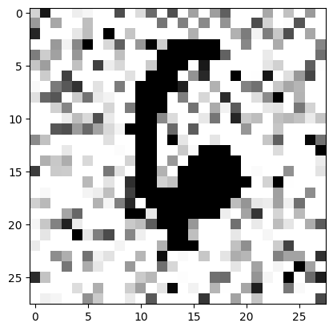
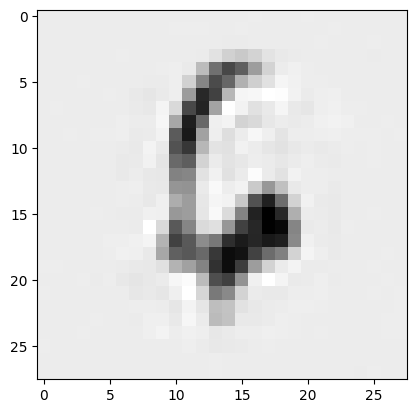

<!--
 * @Author: hibana2077 hibana2077@gmail.com
 * @Date: 2024-01-22 21:38:11
 * @LastEditors: hibana2077 hibana2077@gmail.com
 * @LastEditTime: 2024-01-22 22:10:33
 * @FilePath: /simple-mnist-upscale-model/README.md
 * @Description: 这是默认设置,请设置`customMade`, 打开koroFileHeader查看配置 进行设置: https://github.com/OBKoro1/koro1FileHeader/wiki/%E9%85%8D%E7%BD%AE
-->
# Simple mnist upscale model


## Introduction

This is a simple model to upscale mnist images.

I randomly added noise to the images and then trained a model to remove the noise.





## Installation

This project uses [Keras](https://keras.io/) and use [PyTorch](https://pytorch.org/) as backend.

```py
import os
os.environ['KERAS_BACKEND'] = 'torch'
import keras
```

Install the dependencies using [pip](https://pip.pypa.io/en/stable/):

```sh
pip install -r requirements.txt
```

## Usage

### Jupyter Notebook

You can run the notebook using [VSCode](https://code.visualstudio.com/) or [Jupyter Notebook](https://jupyter.org/).

### Streamlit

You can run the app using [Streamlit](https://streamlit.io/).

```sh
cd web_app
streamlit run app.py
```

## License

[MIT](https://choosealicense.com/licenses/mit/)
